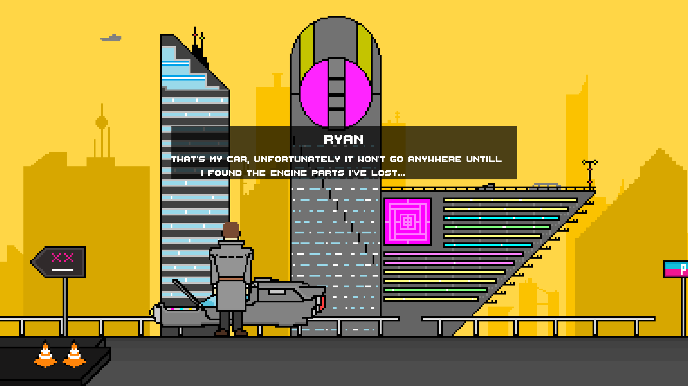

<h1>Knife Walker</h1>
 

A short 2D pixel-art point-and-click adventure inspired by Blade Runner and classic noir detective stories.
This is an early demo scene showcasing basic mechanics and interactions, created using Unity and the Adventure Creator toolkit.

The purpose of this archive is to preserve and maintain this game in a playable state on a modern version of the Unity engine.

Click to start the GIF

Screenshots

Main goals of this repository:
* Preserving the project as a milestone of my early development journey.
* Keeping the game functional on newer versions of Unity.
* Maintaining retro aesthetic, blending pixel-art with cyber-noir atmosphere.
* Fixing minor issues and polishing core interactions for smoother experience.

